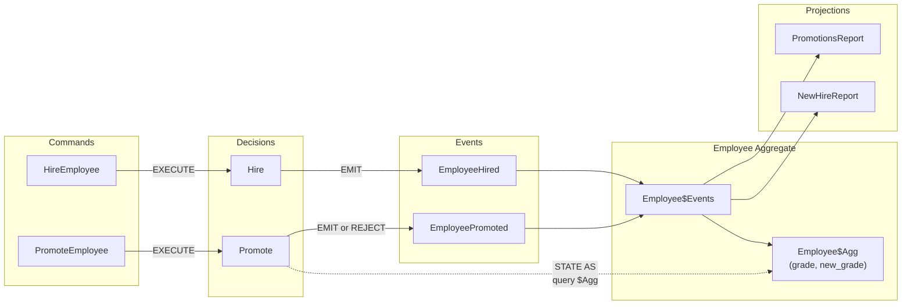

A step-by-step introduction to DeQL using an Employee domain. Covers every core concept: aggregate boundaries, commands, events, guarded decisions, and projections.

## Domain

An HR system that handles hiring and promotions. An employee can be hired unconditionally, but promotions are guarded — you can't promote someone to the same grade they already hold.

## Runtime Behavior



**Flow:**
1. `HireEmployee` command → `Hire` decision → emits `EmployeeHired` (unconditional)
2. `PromoteEmployee` command → `Promote` decision → queries `Employee$Agg` for `current_grade` → emits `EmployeePromoted` if grade differs, rejects otherwise
3. Events flow into `Employee$Events`, which feeds both `Employee$Agg` (write-side state) and the projections (read-side reports)

## Define the Aggregate and Commands

```deql
CREATE AGGREGATE Employee;

CREATE COMMAND HireEmployee (
  employee_id STRING,
  name        STRING,
  grade       STRING
);

CREATE COMMAND PromoteEmployee (
  employee_id STRING,
  new_grade   STRING
);
```

## Register Events

```deql
CREATE EVENT EmployeeHired (
  name  STRING,
  grade STRING
);

CREATE EVENT EmployeePromoted (
  new_grade STRING
);
```

## Wire Up Decisions

Hiring is unconditional — any valid command produces an event:

```deql
CREATE DECISION Hire
FOR Employee
ON COMMAND HireEmployee
EMIT AS
  SELECT EVENT EmployeeHired (
    name  := :name,
    grade := :grade
  );
```

Promotion is guarded. The decision queries the current derived state via `$Agg` and only emits if the new grade differs:

```deql
CREATE DECISION Promote
FOR Employee
ON COMMAND PromoteEmployee
STATE AS
  SELECT COALESCE(new_grade, grade) AS current_grade
  FROM DeReg."Employee$Agg"
  WHERE aggregate_id = :employee_id
EMIT AS
  SELECT EVENT EmployeePromoted (
    new_grade := :new_grade
  )
  WHERE :new_grade <> current_grade;
```

## Add Projections

Two read models from the same event stream — one for Finance, one for Accounts:

```deql
CREATE PROJECTION NewHireReport AS
SELECT
  stream_id AS employee_id,
  LAST(data.name)  AS name,
  LAST(data.grade) AS hired_grade
FROM DeReg."Employee$Events"
WHERE event_type = 'EmployeeHired'
GROUP BY stream_id;

CREATE PROJECTION PromotionsReport AS
SELECT
  stream_id AS employee_id,
  seq,
  data.new_grade AS promoted_to
FROM DeReg."Employee$Events"
WHERE event_type = 'EmployeePromoted'
ORDER BY employee_id, seq;
```

## Execute and Observe

```deql
EXECUTE HireEmployee(employee_id := 'EMP-001', name := 'Alice', grade := 'L4');

  ✓ EmployeeHired
    stream_id:     EMP-001
    seq:           1
    name:  Alice
    grade:  L4
```

```deql
EXECUTE PromoteEmployee(employee_id := 'EMP-001', new_grade := 'L5');

  ✓ EmployeePromoted
    stream_id:     EMP-001
    seq:           2
    new_grade:  L5
```

Try promoting to the same grade — the guard rejects it:

```deql
EXECUTE PromoteEmployee(employee_id := 'EMP-001', new_grade := 'L5');

  ✗ REJECTED
    decision:  Promote
    guard:     :new_grade <> current_grade
    state:     current_grade = 'L5'
    command:   employee_id = 'EMP-001'
    command:   new_grade = 'L5'
```

## Query Projections

```deql
SELECT * FROM DeReg."NewHireReport" ORDER BY employee_id;

+-------------+-------+-------------+
| employee_id | name  | hired_grade |
+-------------+-------+-------------+
| EMP-001     | Alice | L4          |
+-------------+-------+-------------+
```

```deql
SELECT * FROM DeReg."PromotionsReport";

+-------------+-----+-------------+
| employee_id | seq | promoted_to |
+-------------+-----+-------------+
| EMP-001     | 2   | L5          |
+-------------+-----+-------------+
```

## What This Demonstrates

- **Aggregate** as a consistency boundary
- **Commands** expressing intent
- **Events** as immutable facts
- **Guarded decisions** with `$Agg` STATE AS + WHERE
- **Projections** as derived read models
- **Rejection** with full diagnostic output (guard, state, command values)
