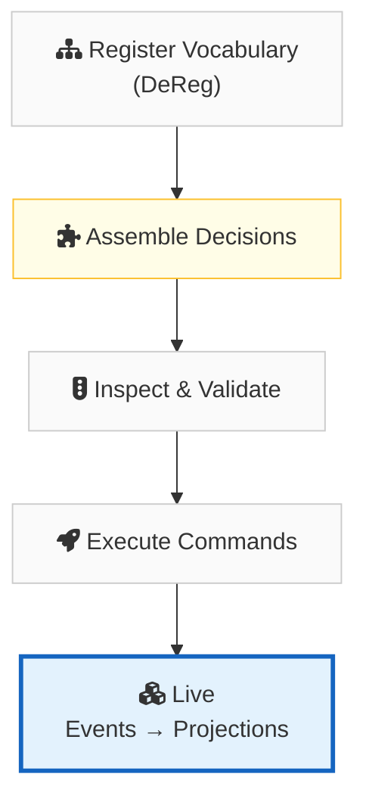
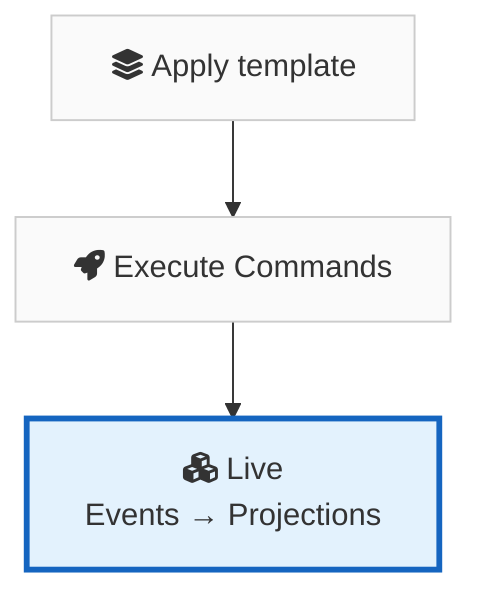

import { Card, CardGrid } from '@astrojs/starlight/components';
import AsciinemaPlayer from '../../components/AsciinemaPlayer.astro';

<AsciinemaPlayer file="initial_demo.cast" speed={.75} rows={20} fontSize="14px"/>

<div style="font-size: 1.15rem; line-height: 2.2; margin-bottom: 2rem;">
✅ Executable decisions<br/>
✅ First‑class inspection of events and aggregates<br/>
✅ Disposable, replayable projections
</div>

## The process 


## Quick Start



One template. One line. A fully operational event-sourced system.

```deql
APPLY TEMPLATE wallet_aggregate
WITH (wallet_name = 'Main', currency = 'USD');
```

That single line expands into a fully functional system:

**What you get**

- **Aggregate** — `MainWallet` with typed state (`wallet_id`, `currency`, `balance`)
- **Commands** — `TopUpMain` and `DebitMain` expressing caller intent
- **Events** — `MainWalletToppedUp` and `MainWalletDebited` as immutable facts
- **Decisions** — `TopUpMain` (unconditional credit) and `DebitMain` (guarded: `WHERE balance >= :amount`)
- **Default Projection** — `MainWalletBalance` read model auto-generated with the same fields as the aggregate

Spin up more wallets in one line each:

```deql
APPLY TEMPLATE wallet_aggregate
WITH (wallet_name = 'Promo', currency = 'USD');

APPLY TEMPLATE wallet_aggregate
WITH (wallet_name = 'Roaming', currency = 'USD');

APPLY TEMPLATE wallet_aggregate
WITH (wallet_name = 'CorporatePool', currency = 'USD');
```

Four aggregates, eight commands, eight events, eight decisions — zero boilerplate.

Send a command:

```deql
EXECUTE TopUpMain(wallet_id := 'wal-001', amount := 100.00);

  ✓ MainWalletToppedUp
    stream_id:     wal-001
    seq:           1
    amount:        100.00
    balance_after: 100.00
```

Query the projection:

```deql
SELECT * FROM DeReg.MainWalletBalance;

  wallet_id | currency | balance
  ----------|----------|--------
  wal-001   | USD      | 100.00
```

Inspect before you ship:

```deql
CREATE TABLE test_topups AS
VALUES ('wal-001'::UUID, 100.00);

INSPECT DECISION TopUpMain
FROM test_topups
INTO simulated_events;

INSPECT PROJECTION MainWalletBalance
FROM simulated_events
INTO simulated_balances;

SELECT * FROM simulated_balances;
```

Inspection runs in production or any environment without altering domain facts.

<CardGrid stagger>
	<Card title="Overview" icon="open-book">
		Learn [what DeQL is](./overview/) and the core philosophy behind it.
	</Card>
	<Card title="Language Reference" icon="document">
		Explore the full [language reference](./concepts/aggregate/) — aggregates, commands, events, decisions, projections, templates, and more.
	</Card>
	<Card title="Two-Phase Model" icon="setting">
		Understand the [two-phase model](./two-phase-model/) — definitions then decision assembly.
	</Card>
	<Card title="Examples" icon="rocket">
		See complete working systems: [Inventory](./examples/inventory-system/), [Registry](./examples/registry-system/), [Telecom Wallet](./examples/telecom-wallet/).
	</Card>
</CardGrid>
