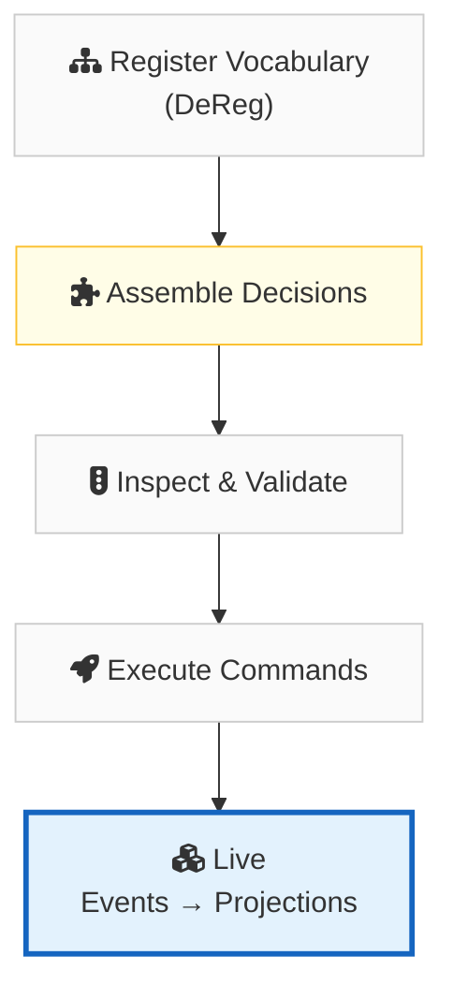
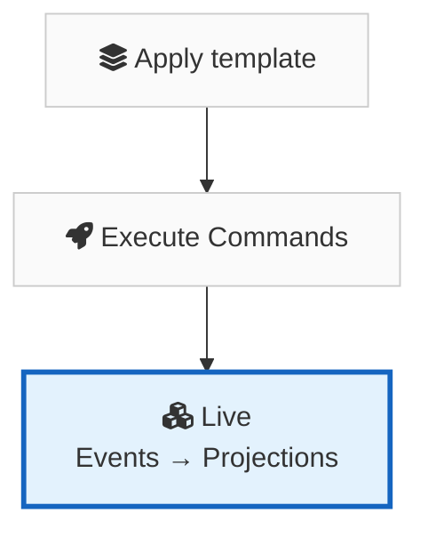

import { Card, CardGrid } from '@astrojs/starlight/components';
import AsciinemaPlayer from '../../components/AsciinemaPlayer.astro';

<div style="text-align: center; margin-bottom: 2rem;">
  <p style="font-size: 1.25rem; opacity: 0.85; max-width: 640px; margin: 0 auto;">
    DEQL lets you model CQRS‑ES systems as specifications, not scattered implementation details.
  </p>
</div>

<AsciinemaPlayer file="initial_demo.cast" speed={.75} rows={20} fontSize="14px"/>

<div style="font-size: 1.15rem; line-height: 2.2; margin-bottom: 2rem;">
✅ Executable decisions<br/>
✅ First‑class inspection of events and aggregates<br/>
✅ Disposable, replayable projections
</div>

<div style="text-align: center; margin: 1.5rem 0 2rem;">
  <a href="https://deql-lang.github.io/deql-editor/" target="_blank" rel="noopener noreferrer" style="display: inline-block; padding: 0.75rem 2rem; font-size: 1.1rem; font-weight: 600; color: #fff; background: var(--sl-color-text-accent, #3b82f6); border-radius: 8px; text-decoration: none;">
    Try DeQL in the browser →
  </a>
</div>

## With DeQL vs. Without DeQL

<div class="comparison-grid">
<div class="comparison-col comparison-without">

**Without DeQL**

- Aggregates, commands, events scattered across files and frameworks
- Business rules buried in imperative code
- Projections hand-wired with custom event handlers
- No built-in way to inspect or simulate decisions
- Changing a rule means touching multiple layers
- Testing requires spinning up infrastructure

</div>
<div class="comparison-col comparison-with">

**With DeQL**

- Aggregates, commands, events declared in one place
- Business rules expressed as guarded decisions (`WHERE balance >= :amount`)
- Projections auto-generated from aggregate definitions
- `INSPECT` lets you simulate decisions and projections without side effects
- Changing a rule means editing one declaration
- Testing is just `INSPECT` — no infrastructure needed

</div>
</div>

<div style="text-align: center; margin: 2rem 0;">
  <a href="./overview/" style="font-size: 1.1rem; font-weight: 500; color: var(--sl-color-text-accent); text-decoration: none;">
    Learn more — deep dive into the overview →
  </a>
</div>

## The process 


## A Complete Example — Employee Domain

Let's build a real CQRS-ES system from scratch. We'll model an Employee domain that handles hiring and promotions.

First, define the aggregate boundary and the commands it accepts:

```deql
CREATE AGGREGATE Employee;

CREATE COMMAND HireEmployee (
  employee_id STRING,
  name        STRING,
  grade       STRING
);

CREATE COMMAND PromoteEmployee (
  employee_id STRING,
  new_grade   STRING
);
```

Register the events these commands can produce:

```deql
CREATE EVENT EmployeeHired (
  name  STRING,
  grade STRING
);

CREATE EVENT EmployeePromoted (
  new_grade STRING
);
```

Now wire up the business logic as decisions. Hiring is unconditional, but promotions are guarded — you can't promote someone to the same grade:

```deql
CREATE DECISION Hire
FOR Employee
ON COMMAND HireEmployee
EMIT AS
  SELECT EVENT EmployeeHired (
    name  := :name,
    grade := :grade
  );

CREATE DECISION Promote
FOR Employee
ON COMMAND PromoteEmployee
STATE AS
  SELECT
    LAST(
      CASE
        WHEN event_type = 'EmployeeHired'    THEN data.grade
        WHEN event_type = 'EmployeePromoted'  THEN data.new_grade
        ELSE NULL
      END
    ) AS current_grade
  FROM DeReg."Employee$Events"
  WHERE stream_id = :employee_id
EMIT AS
  SELECT EVENT EmployeePromoted (
    new_grade := :new_grade
  )
  WHERE :new_grade <> current_grade;
```

Add read-side projections — a new-hire report and a promotions report:

```deql
CREATE PROJECTION NewHireReport AS
SELECT
  stream_id AS employee_id,
  LAST(data.name)  AS name,
  LAST(data.grade) AS hired_grade
FROM DeReg."Employee$Events"
WHERE event_type = 'EmployeeHired'
GROUP BY stream_id;

CREATE PROJECTION PromotionsReport AS
SELECT
  stream_id AS employee_id,
  seq,
  data.new_grade AS promoted_to
FROM DeReg."Employee$Events"
WHERE event_type = 'EmployeePromoted'
ORDER BY employee_id, seq;
```

The system is ready. Execute some commands:

```deql
EXECUTE HireEmployee(employee_id := 'EMP-001', name := 'Alice', grade := 'L4');

  ✓ EmployeeHired
    stream_id:     EMP-001
    seq:           1
    name:          Alice
    grade:         L4
```

```deql
EXECUTE PromoteEmployee(employee_id := 'EMP-001', new_grade := 'L5');

  ✓ EmployeePromoted
    stream_id:     EMP-001
    seq:           2
    new_grade:     L5
```

Try promoting to the same grade again — the decision guard rejects it:

```deql
EXECUTE PromoteEmployee(employee_id := 'EMP-001', new_grade := 'L5');

  ✗ REJECTED
    decision:  Promote
    guard:     :new_grade <> current_grade
    state:     current_grade = 'L5'
    command:   employee_id = 'EMP-001'
    command:   new_grade = 'L5'
```

Query the projections:

```deql
SELECT * FROM DeReg."NewHireReport" ORDER BY employee_id;

  +-------------+-------+-------------+
  | employee_id | name  | hired_grade |
  +-------------+-------+-------------+
  | EMP-001     | Alice | L4          |
  +-------------+-------+-------------+

SELECT * FROM DeReg."PromotionsReport";

  +-------------+-----+-------------+
  | employee_id | seq | promoted_to |
  +-------------+-----+-------------+
  | EMP-001     | 2   | L5          |
  +-------------+-----+-------------+
```

That's a full CQRS-ES system — aggregate, commands, events, guarded decisions, and projections — all declared, no boilerplate.

---

<div style="text-align: center; margin: 2.5rem 0 1rem;">
  <p style="font-size: 1.2rem; font-weight: 500; opacity: 0.9;">
    Want a simpler, repeatable process? Look at templates.
  </p>
</div>

## Quick Start with Templates



One template. One line. A fully operational event-sourced system.

```deql
APPLY TEMPLATE wallet_aggregate
WITH (wallet_name = 'Main', currency = 'USD');
```

That single line expands into a fully functional system:

- **Aggregate** — `MainWallet` with typed state (`wallet_id`, `currency`, `balance`)
- **Commands** — `TopUpMain` and `DebitMain` expressing caller intent
- **Events** — `MainWalletToppedUp` and `MainWalletDebited` as immutable facts
- **Decisions** — `TopUpMain` (unconditional credit) and `DebitMain` (guarded: `WHERE balance >= :amount`)
- **Default Projection** — `MainWalletBalance` read model auto-generated with the same fields as the aggregate

Spin up more wallets in one line each:

```deql
APPLY TEMPLATE wallet_aggregate
WITH (wallet_name = 'Promo', currency = 'USD');

APPLY TEMPLATE wallet_aggregate
WITH (wallet_name = 'Roaming', currency = 'USD');

APPLY TEMPLATE wallet_aggregate
WITH (wallet_name = 'CorporatePool', currency = 'USD');
```

Four aggregates, eight commands, eight events, eight decisions — zero boilerplate.

Send a command:

```deql
EXECUTE TopUpMain(wallet_id := 'wal-001', amount := 100.00);

  ✓ MainWalletToppedUp
    stream_id:     wal-001
    seq:           1
    amount:        100.00
    balance_after: 100.00
```

Query the projection:

```deql
SELECT * FROM DeReg.MainWalletBalance;

  wallet_id | currency | balance
  ----------|----------|--------
  wal-001   | USD      | 100.00
```

Inspect before you ship:

```deql
CREATE TABLE test_topups AS
VALUES ('wal-001'::UUID, 100.00);

INSPECT DECISION TopUpMain
FROM test_topups
INTO simulated_events;

INSPECT PROJECTION MainWalletBalance
FROM simulated_events
INTO simulated_balances;

SELECT * FROM simulated_balances;
```

Inspection runs in production or any environment without altering domain facts.

<CardGrid stagger>
	<Card title="Overview" icon="open-book">
		Learn [what DeQL is](./overview/) and the core philosophy behind it.
	</Card>
	<Card title="Language Reference" icon="document">
		Explore the full [language reference](./concepts/aggregate/) — aggregates, commands, events, decisions, projections, templates, and more.
	</Card>
	<Card title="Two-Phase Model" icon="setting">
		Understand the [two-phase model](./two-phase-model/) — definitions then decision assembly.
	</Card>
	<Card title="Examples" icon="rocket">
		See complete working systems: [Inventory](./examples/inventory-system/), [Registry](./examples/registry-system/), [Telecom Wallet](./examples/telecom-wallet/).
	</Card>
</CardGrid>
