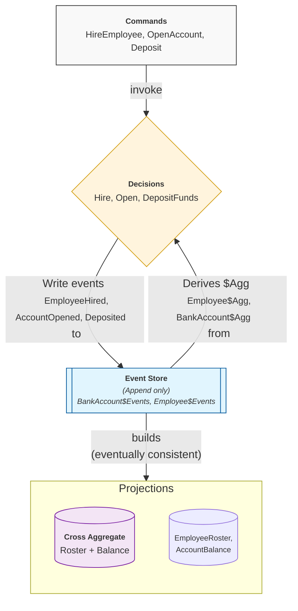

DeQL (Decision Query Language, pronounced "deck-el") is a declarative language for building `CQRS` and `Event-Sourced` systems that evolve gracefully with changing business needs.

## What Problem Does DeQL Solve?

Traditional CQRS/ES implementations suffer from:

- Upfront design burden: Aggregates, invariants, and event schemas must be perfectly defined before any code runs.
- Boilerplate overhead: Command handlers, event handlers, projectors, and wiring code dominate the codebase.
- Rigid evolution: Changing an aggregate or adding a new decision requires touching multiple layers.
- Opaque execution: Understanding what a system actually does when a command arrives requires tracing through multiple handlers.

DeQL addresses these by making decisions the central, inspectable, declarative unit of behavior.

## Core Philosophy

```
Commands represent intent.
Events represent facts.
Aggregates represent derived state.
Decisions define how reality changes.
```

A DeQL system is not a collection of handlers wired together. It is a set of decisions — each one a self-contained, deterministic function from (state + intent) → (new facts).

## How It Works

### Phase 1 — Define Your Domain Vocabulary

```deql
-- Declare what exists in your domain
CREATE AGGREGATE Employee;
CREATE AGGREGATE BankAccount;

CREATE COMMAND HireEmployee (employee_id UUID, name STRING, grade STRING);
CREATE COMMAND PromoteEmployee (employee_id UUID, new_grade STRING);
CREATE COMMAND OpenAccount (account_id UUID, initial_balance DECIMAL(12,2));
CREATE COMMAND Deposit (account_id UUID, amount DECIMAL(12,2));

CREATE EVENT EmployeeHired (name STRING, grade STRING);
CREATE EVENT EmployeePromoted (new_grade STRING);
CREATE EVENT AccountOpened (initial_balance DECIMAL(12,2));
CREATE EVENT Deposited (amount DECIMAL(12,2));
```

### Phase 2 — Assemble Decisions

```deql
-- Simple decision: no state needed
CREATE DECISION Hire
FOR Employee
ON COMMAND HireEmployee
EMIT AS
    SELECT EVENT EmployeeHired (
        name  := :name,
        grade := :grade
    );

-- Decision with STATE AS + WHERE guard
CREATE DECISION DepositFunds
FOR BankAccount
ON COMMAND Deposit
STATE AS
    SELECT initial_balance AS balance
    FROM DeReg."BankAccount$Agg"
    WHERE aggregate_id = :account_id
EMIT AS
    SELECT EVENT Deposited (
        amount := :amount
    )
    WHERE balance >= :amount;
```

### Inspect Before You Commit

```deql
-- Simulate without side effects
CREATE TABLE test_hires AS VALUES
  ('EMP-100', 'Charlie', 'L3'),
  ('EMP-101', 'Diana', 'L5');

INSPECT DECISION Hire
FROM test_hires
INTO simulated_hire_events;

SELECT stream_id, event_type, data
FROM simulated_hire_events;
```

### Execute Commands

```deql
-- Send commands, get events back
EXECUTE HireEmployee(employee_id := 'EMP-001', name := 'Alice', grade := 'L5');
EXECUTE OpenAccount(account_id := 'ACC-001', initial_balance := 1000.00);
EXECUTE Deposit(account_id := 'ACC-001', amount := 500.00);

-- Query the event stream
SELECT stream_id, event_type, seq, data
FROM DeReg."BankAccount$Events"
ORDER BY stream_id, seq;

-- Query aggregate state
SELECT * FROM DeReg."BankAccount$Agg" WHERE aggregate_id = 'ACC-001';

-- Query a projection
SELECT * FROM DeReg."AccountBalance";
```

## Design Principles

1. Declarative over imperative — You describe what should happen, not how.
2. Decisions are first-class — Not buried inside handler methods.
3. Inspection is built-in — Every decision can be simulated without side effects.
4. Progressive evolution — Start simple, refine incrementally.
5. No hidden wiring — The DeReg (Decision Registry) captures the complete execution topology. Every command, decision, event, projection, template, and event store definition is registered there and inspectable via `DESCRIBE`.

## DeReg: Decision Registry

DeReg stands for **Decision Registry**.

It is the registry that holds the compiled DeQL definitions for a system: aggregates, commands, events, decisions, projections, templates, and event stores. In other words, DeReg is the portable structural model of a DeQL application.

## Runtime Model


## Relationship to Disintegrate

DeQL is inspired by the [Disintegrate](https://disintegrate-es.github.io/disintegrate/)  approach to decision‑centric architectures.
Where Disintegrate describes how to reason about decisions, state, and change over time, DeQL provides a language for expressing those ideas in a structured and executable form.

